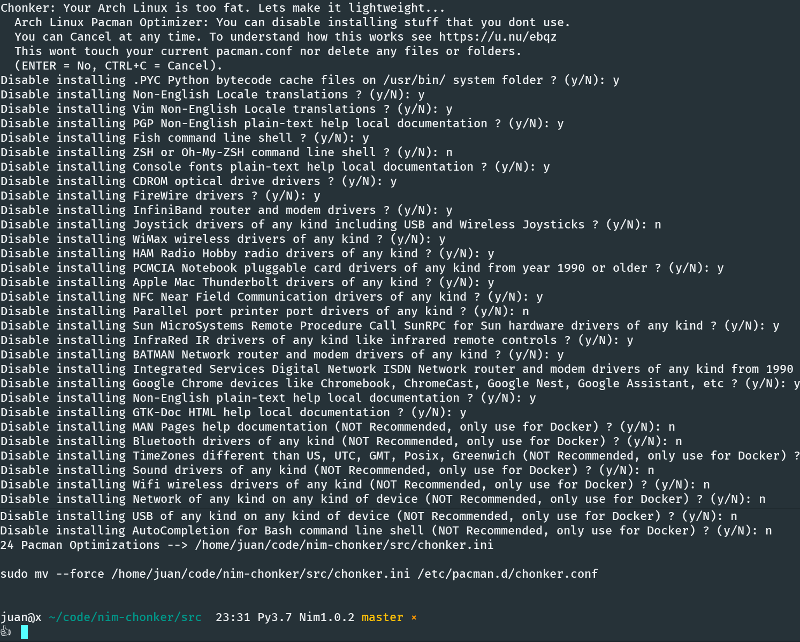

# Chonker

- Chonker: Your Arch Linux is too fat. Lets make it lightweight...
- 1 File, 0 Dependency, no config, no setup, works Offline, 15 lines of code, Does **NOT overwrite any config** by default.

